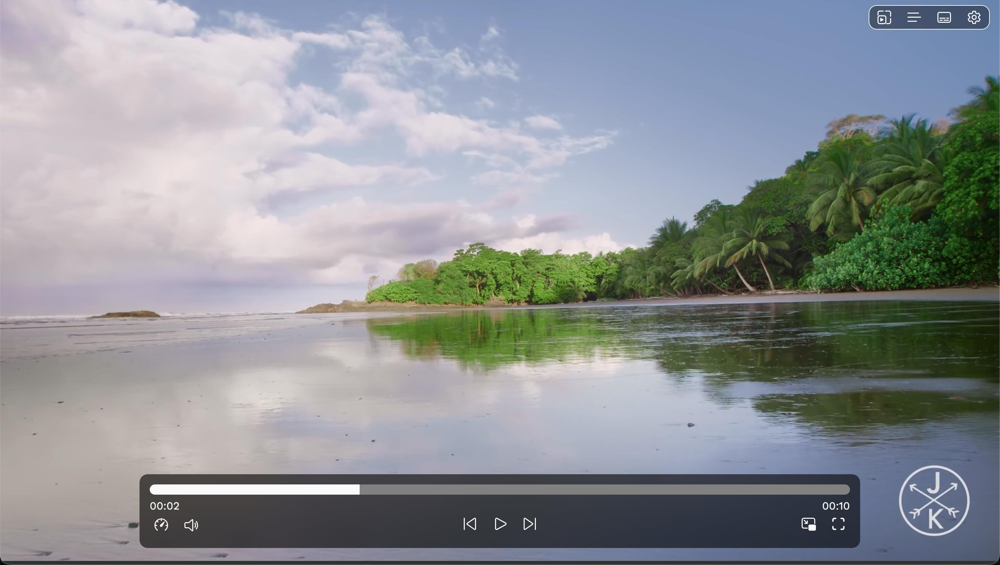

# VideoPlay

VideoPlay is a local video player that permits to play video files saved on the user's device without downloading third-party applications or uploading them to an external server.

Try it: https://dinoosauro.github.io/VideoPlay/

## Usage

After you've picked some videos, they'll start playing. Hover the video player to show all the controls. 

### Bottom bar

Along with the essential buttons (play/pause button, next/previous video) and the video duration slider, you'll find:
- The playback rate button, that permits to change the video speed;
- The volume button, that permits to change the video volume;
- The Picture-in-Picture button
- The fullscreen mode button

### Top buttons

On the top-right corner, you can find four buttons:

- The first one will switch along all the three supported filling mode (normal, scale, stretch);
- The second one will show the queue. From the queue you can add more files, loop the current video and read all of the metadata stored in the video (by clicking the "Info" icon of each video in the queue);
- The third one will permit to pick some subtitles from the user's drive. If you want to disable subtitles, click it and don't upload anything;
- The fourth one will open the Settings.

## Privacy

Everything is stored locally, and the application can work completely offline.